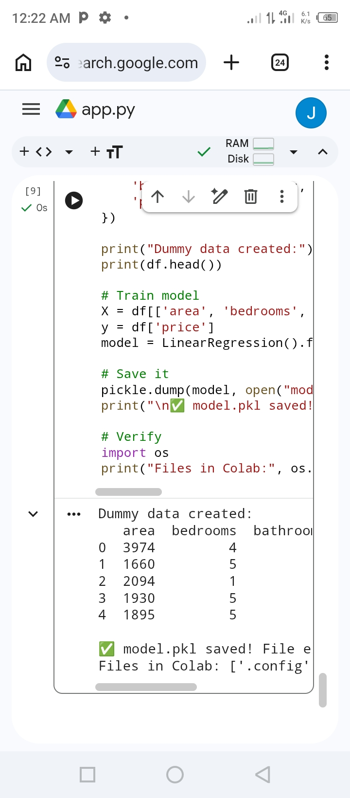
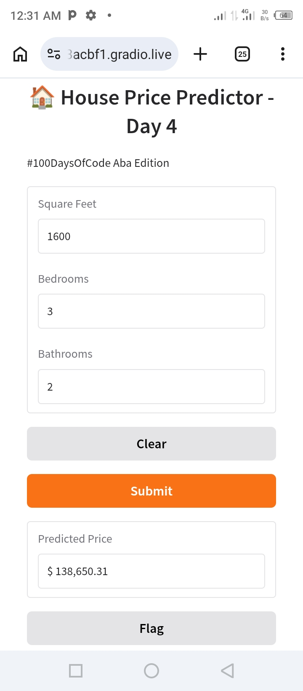
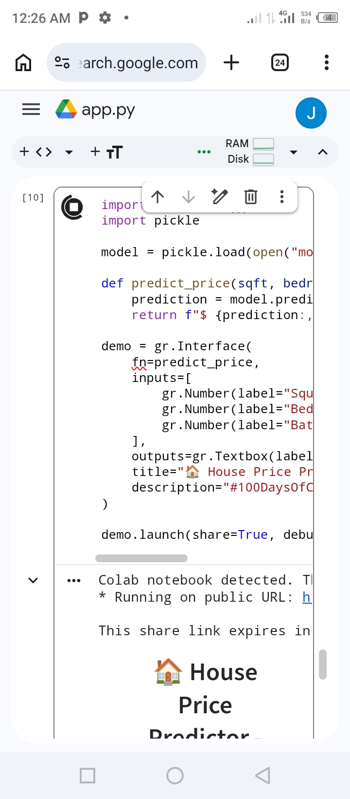

# Aba-ml-journey-
Day 1: Learning ML Engineering from Android in Aba 

Learning ML Engineering from scratch, using only Android.

## Day 1: Setup 
- Created GitHub account + repo
- Goal: Learn ML → ML Engineering step by step

## Day 2: Train + Save Model
- Trained Linear Regression for house price prediction  
- Used joblib.dump() to save model + features to .pkl
- Next: Learn how to load model and predict

## How to run
1. Open notebook.ipynb in Google Colab Run all cell
- Used joblib.load() to load saved model
- Made predictions on new house data
- Goal- nextrap this in a simsimple API's next

## Day 3: Save & Load Model
- Trained Linear Regression on house data
- Saved model with joblib: model.pkl, features.pkl  
- Loaded model to predict: 1600 sqft, 3 bed, 7yr old = $234,687.20- 

## Day 4/100: ML Web App with Gradio ✅

**Project**: House Price Predictor UI  
**Tech Stack**: Python, scikit-learn, Gradio, Colab, pickle  
**Deployed**: gradio.live share link

### What it does
Takes user input → sqft, bedrooms, bathrooms → predicts house price in real-time

**Example Prediction:**  
Input: 1600 sqft, 3 bedrooms, 2 bathrooms  
Output: `$138,650.31`

### Challenges I killed
1. `FileNotFoundError` - model.pkl missing after Colab reset
2. `LocalTunnel 502/503` - Aba 30 B/s network vs Gradio tunneling 
3. Colab runtime disconnections
4. Stress-deleting files at 4 AM

**Lesson learned**: Never delete files from stress. Debug first, delete last.

### Screenshots

   **Gradio UI:**
   

   **Prediction $138,650.31:**
   

### Links
**Live Demo**: [gradio.live/xxxxx] - expires in 72hrs  
**Code**: [Colab Notebook link]
  

**Prediction Proof**: 
Input: 1600 sqft, 3bd, 2ba
Output: $138,650.31
Timestamp: April 8, 2026 1:37 AM WAT

### Day 4 Screenshots

**1. Training Complete:**

**2. Prediction Live:**

## Day 4 Proof - House Price Predictor

**Gradio UI with inputs:**

**Prediction Result:**

**Repo**: https://github.com/Johnzecus-ml-dev/aba-ml-journey-
